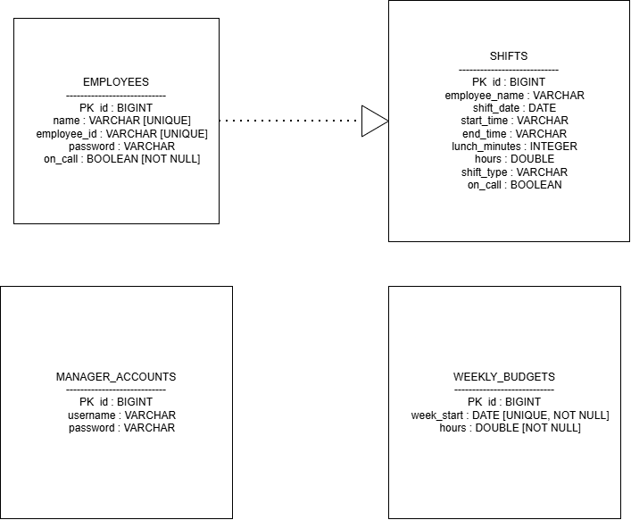
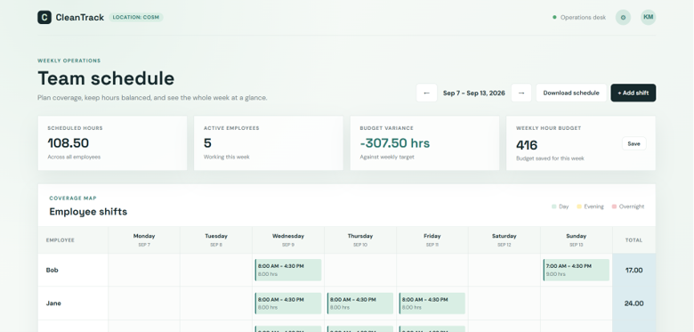
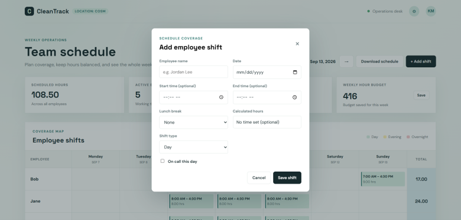
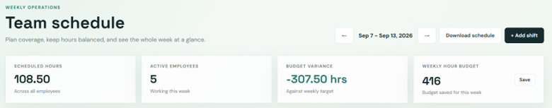
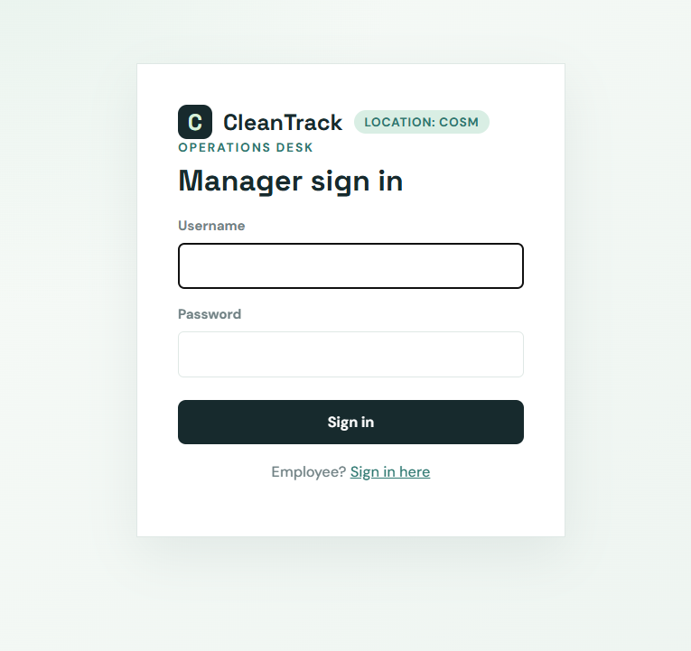
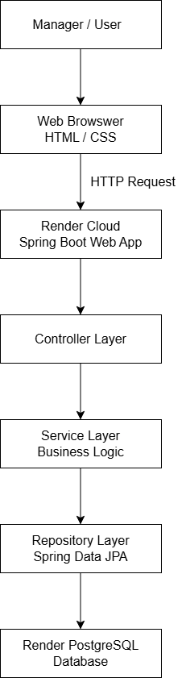

# CleanTrack Scheduling App

CleanTrack is a Spring Boot weekly scheduling MVP for janitorial operations. It provides a schedule grid, shift entry, employee totals, daily coverage, a weekly hour budget, and automatic variance calculations.

## Project Overview

CleanTrack gives managers a schedule grid for planning shifts and gives employees a read-only view of that same schedule, accessible with just a 5-digit employee ID.

## Problem

Janitorial employee scheduling can become difficult when schedules are managed manually or through spreadsheets.

Managers need a centralized way to organize shifts, track employee hours, monitor daily coverage, and compare scheduled hours against weekly labor-hour budgets.

CleanTrack was developed to simplify this process through a web-based scheduling system.

## Main Features

- Weekly employee schedule grid
- Employee shift entry
- Automatic employee hour totals
- Daily staffing coverage
- Weekly hour budget tracking, saved per week
- Automatic variance calculations
- Manager login
- Employee login with a 5-digit ID, view-only access to the schedule
- Persistent database support

## Technologies Used

### Backend

- Java
- Spring Boot
- Spring Data JPA

### Frontend

- HTML
- CSS

### Database

- H2 for local demonstration
- PostgreSQL for production deployment

CleanTrack uses H2 for local development and PostgreSQL for the production deployment on Render.

The current persistence model includes employees, shifts, manager accounts, and weekly labor-hour budgets.

## Database Design

The following ERD represents the current CleanTrack database model.



## Application Screenshots

### Weekly Scheduling Dashboard

The weekly scheduling dashboard allows management to review employee shifts, scheduled hours, and staffing coverage.



### Shift Entry

Managers can enter and update employee shift information.



### Labor Hours and Variance

CleanTrack automatically calculates scheduled employee hours and compares them against the weekly labor-hour budget.


### Daily Staffing Coverage

The dashboard also surfaces daily staffing coverage alongside the weekly budget variance, so managers can see gaps at a glance.



### Manager Login

Access to the scheduling system is protected by manager authentication.



### Development and Deployment

- Visual Studio Code
- Maven
- Git
- GitHub
- Docker
- Render

## Application Architecture

CleanTrack follows a layered Spring Boot architecture.

Managers and employees interact with the application through a web browser. Requests are handled by the Spring Boot application deployed as a Render Web Service. Controllers call Spring Data JPA repositories directly, which provide database access to PostgreSQL hosted on Render.



## Run Locally

1. Install Java 17+ and Maven 3.9+.
2. Run `mvn spring-boot:run` from the project folder.
3. Open `http://localhost:8080`.

The default profile uses an in-memory H2 database so the demo works immediately.

For production, CleanTrack uses PostgreSQL. Database connection settings are supplied through environment variables rather than hard-coded credentials in `application.properties`, and the `prod` Spring profile must be active.

Example:

```properties
spring.datasource.url=jdbc:postgresql://${DB_HOST}:${DB_PORT:5432}/${DB_NAME}
spring.datasource.username=${DB_USERNAME}
spring.datasource.password=${DB_PASSWORD}
spring.jpa.hibernate.ddl-auto=validate
spring.flyway.enabled=true
```

Schema changes are managed through Flyway migrations in `src/main/resources/db/migration`, not by Hibernate auto-generating the schema.

## Login

CleanTrack has two ways to sign in:

- **Manager login** (`/login.html`) — username and password, full read/write access to the schedule.
- **Employee login** (`/employee-login.html`) — a 5-digit employee ID, no separate password, view-only access to the schedule. A manager assigns each employee their ID from the schedule page.

For local development, manager credentials are configured through the development application properties or environment variables. These local credentials are for development only.

The local login page is:

```text
http://localhost:8080/login.html
```

In production on Render, manager credentials are supplied through environment variables:

```text
MANAGER_USERNAME
MANAGER_PASSWORD
```

Real production credentials should never be committed to GitHub or stored directly in `application.properties`.

## Project Structure

```text
CleanTrack/
|
├── src/
│   ├── main/
│   │   ├── java/
│   │   │   └── com/janitorial/schedule/
│   │   │       ├── model/            # JPA entities and repositories
│   │   │       ├── security/         # Spring Security config, user details, CSRF
│   │   │       ├── ScheduleController.java
│   │   │       ├── EmployeeController.java
│   │   │       ├── AccountController.java
│   │   │       └── ScheduleApplication.java
│   │   │
│   │   └── resources/
│   │       ├── static/               # index.html, login.html, app.js, styles.css
│   │       ├── db/migration/         # Flyway schema migrations
│   │       ├── application.properties
│   │       ├── application-prod.properties
│   │       └── data.sql
│   │
│   └── test/
│       └── java/
│
├── .gitignore
├── Dockerfile
├── pom.xml
└── README.md
```

## Database

CleanTrack uses H2 for local development and PostgreSQL for the production deployment on Render.

The database stores application information related to:

- Employees
- Employee roles
- Shifts
- Weekly schedules
- Scheduled hours
- Daily staffing coverage
- Weekly labor-hour budgets

Spring Data JPA provides the persistence layer between the Spring Boot application and the database.

## Security

Sensitive information is supplied through environment variables instead of being committed directly to the repository.

Examples include:

```text
SPRING_PROFILES_ACTIVE=prod
DB_HOST
DB_PORT
DB_NAME
DB_USERNAME
DB_PASSWORD
MANAGER_USERNAME
MANAGER_PASSWORD
```

`SPRING_PROFILES_ACTIVE` must be set to `prod` on the deployed service — without it, the app falls back to its default H2 configuration instead of connecting to PostgreSQL.

Database passwords and production manager credentials should never be committed to GitHub.

## Deployment

CleanTrack is containerized using Docker and deployed as a web service on Render.

The production architecture is:

```text
User Browser
     |
     v
Render Web Service
     |
     v
Spring Boot
     |
     v
Spring Data JPA
     |
     v
Render PostgreSQL
```

## Future Improvements

Future versions of CleanTrack may include:

- Multiple manager accounts
- Employee availability
- Schedule requests
- Email notifications
- Payroll integration
- Reporting and analytics
- Mobile-responsive improvements
- Multiple janitorial locations

## Author

Grant Harper

Software Engineering Portfolio Project
